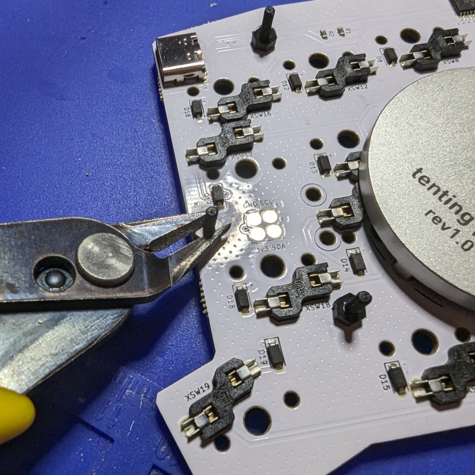

# Chicklet Build Guide

Your Chicklet kit should come with the following:

- A pair of SMT-assembled Chicklet PCBs
- A pair of FR-4 switchplates
- Nylon M2 screws, washers, and nuts to join the PCB and switchplate
- A set of adhesive feet

In addition to a soldering iron, flush cutters, and a screwdriver, you will need these parts:

- One Seeed Xiao RP2040 (or compatible) MCU module
- 38 Kailh Choc switches (Choc V2 is not supported) 
- A set of 38 1u Choc keycaps (18x17mm spacing)
- A USB-C to USB-C cable to connect the two halves
- A USB-C cable to connect the keyboard to a computer

## Build instructions

### 1. Install the microcontroller

The only component that requires soldering is the microcontroller module.

Attach the Xiao to the pads on the back of the left-hand side of the board using your preferred method (i.e., both reflow and iron soldering work well).

### 2. Install a tenting puck (optional)

If you choose to use a tenting puck from splitkb.com, now is a good time to install it. Don't worry, you can still decide to add one later without removing the switchplate.

Align the legs of the puck with the holes on the back of the board. Only two screws are necessary - install them from the front of the PCB.

Repeat for the other half.

### 3. Mount the switchplate

Insert the 5 nylon M2 screws through the front of the switchplate. Use another hard surface to keep
them in place, then flip the PCB over to install the 5 nylon washers.

Insert the PCB over the screws, then install the 5 nuts. After tightening them down, snip off the excess length.

Again, repeat for the other half.

Note that on early Chicklets, clearance is limited to install the nut for the top-right screw
on the right side, as it interferes with the hotswap sockets. Use an extra washer here if you
have this version of the board.

### 4. Install switches and caps

Insert Choc switches into each position on the switchplate. The orientation varies, so pay close
attention.

Do the same for the other half of the board, then proceed to install the keycaps of your choice.

### 5. Finishing up

If you wish to install the rubber adhesive feet in order to use the keyboard flat, do so now.

Connect the two halves of the board with a USB-C cable, using the ports on the inner edges of the halves.

Be careful to never connect these ports to a computer directly - it could damage the keyboard.

Connect the keyboard to a computer using the Xiao's USB port. Flash the firmware and you're ready to go!

