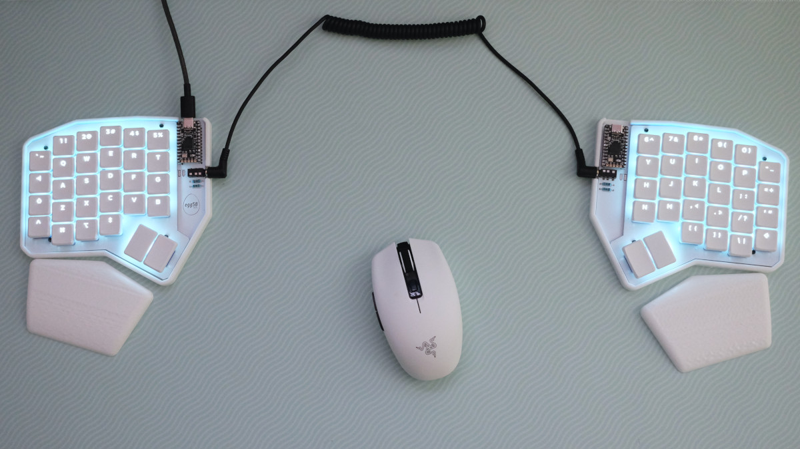
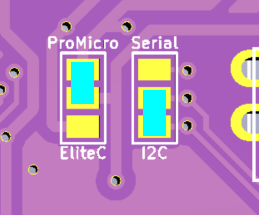
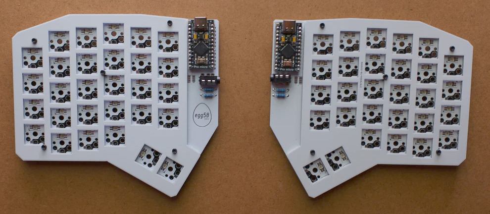

# egg58 Build Guide

Your egg58 kit should come with the following:

- 2 reversible egg58v2.1 PCBs
- 2 reversible FR4 switchplates
- 60 Choc sockets
- 60 RGB LEDs
- 60 diodes (your choice of SMD or through-hole)
- 4 through-hole resistors (10k)
- 2 TRRS jacks
- Nylon M2 screws, washers, and nuts to join the PCB and switchplate
- A set of adhesive feet

In addition to a soldering iron, flush cutters, and a screwdriver, you will need these parts:

- 2 Pro Micro (or compatible) MCU modules
- 58 Kailh Choc switches (Choc V2 is not supported) 
- A set of keycaps (54x 1u, 4x 1.5u)
- A TRRS cable
- A USB cable (depends on your choice of MCU)

## Build instructions

This requires a good bit of experience with soldering, as there are lots of SMT components.

More detailed instructions with pictures are coming soon.

### 1. Install components on the back of each board

The back of the board is mostly SMT, except for the diodes if you have chosen the THT option.

1. Install LEDs such that the notched corner aligns with the indicator on the silkscreen. Be aware that the orientation of the LEDs changes each row.
2. Install diodes, such that the cathode (the side with the line) points toward the square holes (upward).
3. If using through-hole diodes with the FR4 switchplate, ensure that the leads are trimmed very short on the front, otherwise they may scratch through the switchplate solder mask and short out.
4. Install sockets.
5. Solder the two jumpers to select serial/I2C and Elite-C/Pro Micro.
   - The EliteC/ProMicro jumper selects the position of the VBUS/RAW pin, to supply 5v to the LEDs and across the TRRS cable. On the Elite-C, the RAW pin is replaced with an extra I/O pin (B0) and an extra VBUS pin is added above it. Select EliteC in this case, or ProMicro for all others.
   - The Serial/I2C jumper selects which data pin is attached to the TRRS jack. The firmware uses I2C by default, but select Serial if you have customized it.
   - Each jumper should have one "outer" pad soldered to the inner pad, as in the diagram below:

### 2. Install components on the fronts of the boards

All of the components on the front are THT.

6. Install TRRS sockets.
7. Install MCU (preferably in a socket).
8. If using I2C, install the two resistors beneath each TRRS.

### 3. Put the boards together.

The switchplate is mounted to the PCB with 5x M2 screws and nuts. A spacer is recommended between the two layers.

The included screws are nylon, and can be snipped to length after fastening.

Install switches in the sockets, then add your keycaps. Congrats, you're almost done!

The last step is to flash firmware, which can be obtained [here](/docs/firmware).
