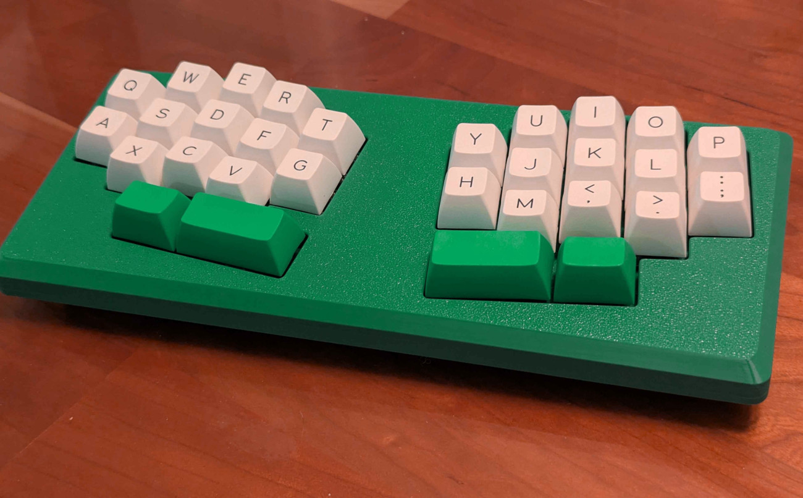
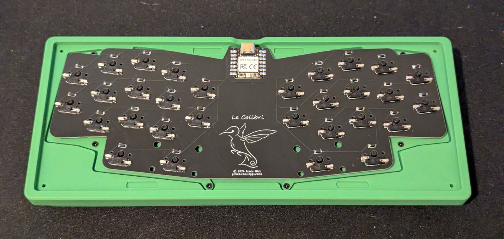

# Le Colibri Build Guide

## Materials

- 1x Le Oeuf PCB
- 1x Seeed Studio XIAO RP2040
- 30x 1N4148 diodes, SOD-123
- 30x Kailh MX hotswap sockets
- 3D printed case and switchplates
- 8x self tapping M2x4 screws
- 4x self tapping M3x12 screws
- 4 self-adhesive bumpons

## Build instructions

More detailed instructions and step-by-step photos coming soon.

1. Solder the Xiao, with components facing the back side of the board, as pictured here. The intent of mid-mounting the Xiao is to put the USB port at the same height as it is on a normal Le Chiffre PCB, so try to get it lined up such that the top of the Xiao PCB lines up with the bottom of the Le Colibri PCB.
2. Solder the diodes.
3. Solder the sockets.
4. Mount the switchplates to the top case using self-tapping M2 screws.
5. Insert switches in the sockets to secure the PCB to the case.
6. Flash firmware before closing up the bottom case.
7. Add the bottom case to the assembly and secure it with self-tapping M3 screws.

## Firmware

ZMK: https://github.com/eggsworks/zmk-config/
