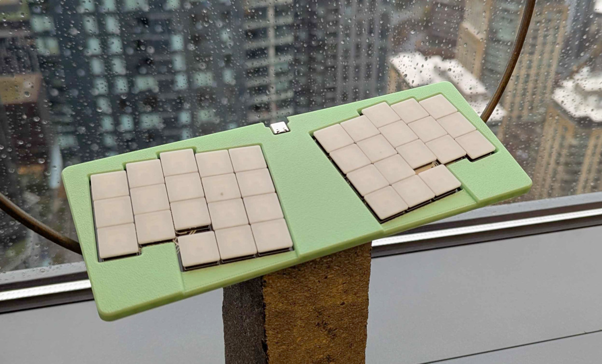
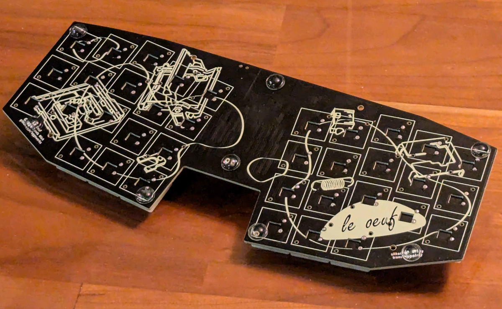
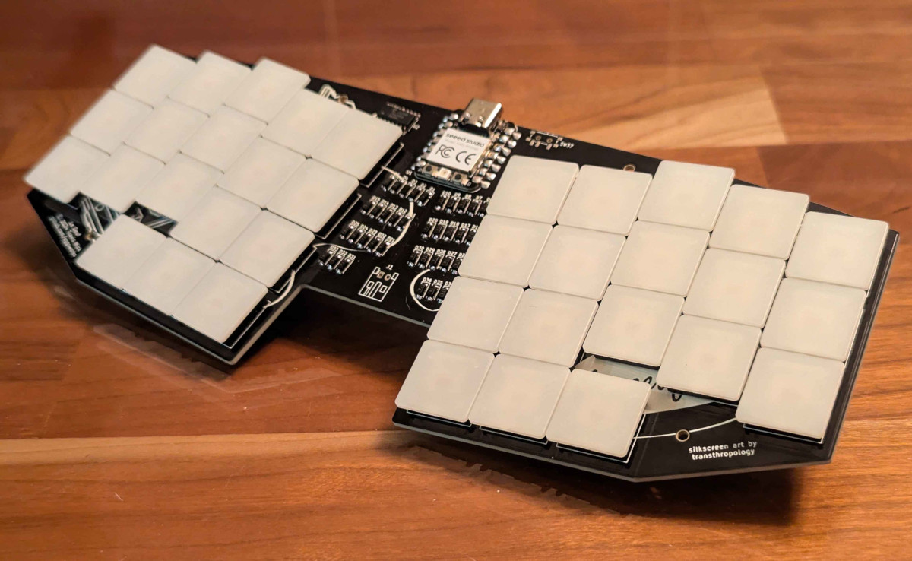

# Le Oeuf (PG1425) Build Guide

## Materials

- 1x Le Oeuf PCB
- 1x Seeed Studio XIAO RP2040
- 1x 74HC595D shift register, SOP-16
- 36x 1N4148 diodes, SOD-123
- 36x Kailh PG1425 "X" Switches
- 36x PG1425 keycaps

Optional
- 4-6x self-adhesive bumpons
- 1x 3D-printed case
- 4x M2x4 self-tapping screws

## Build instructions

More detailed instructions and step-by-step photos coming soon.

1. Solder all surface-mount components on the front of the board (diodes, shift register, XIAO)
2. Solder switches
3. Flash firmware, install caps, and enjoy :D

## Firmware

ZMK: https://github.com/eggsworks/zmk-config/
