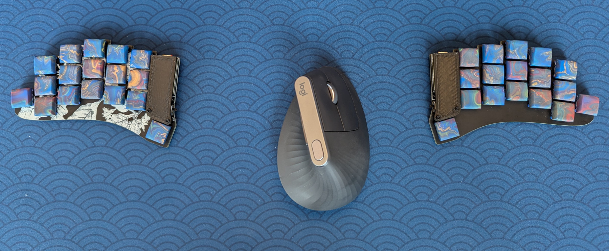
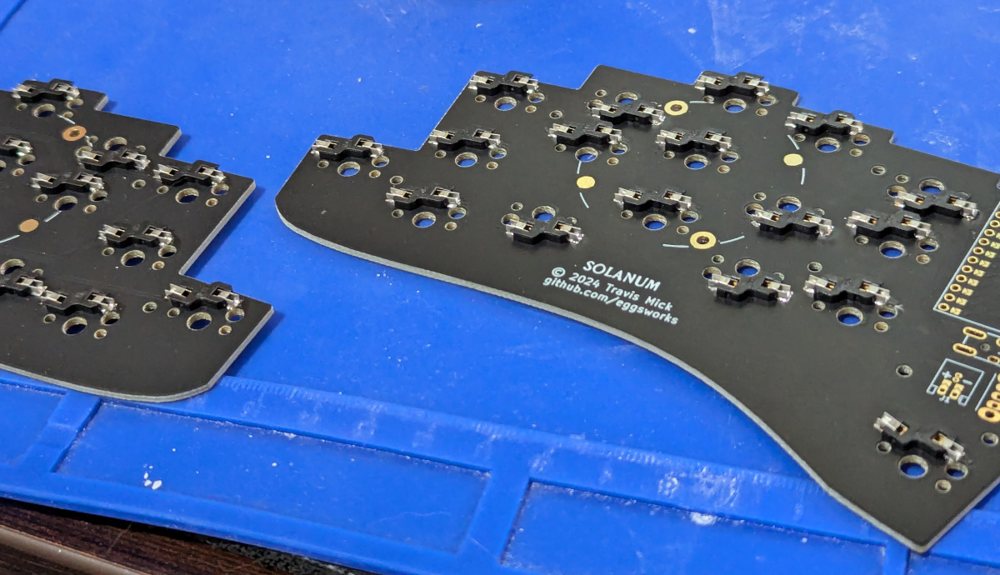
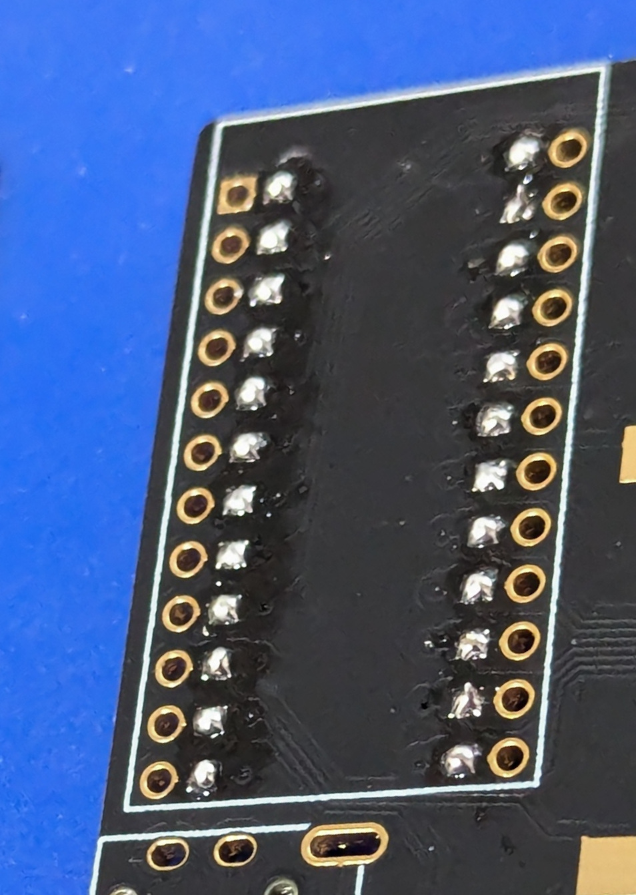
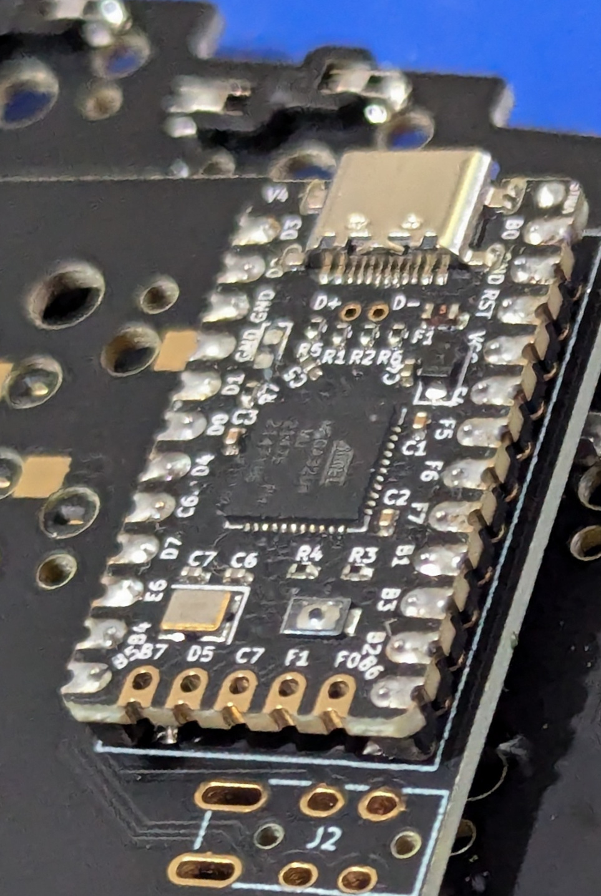
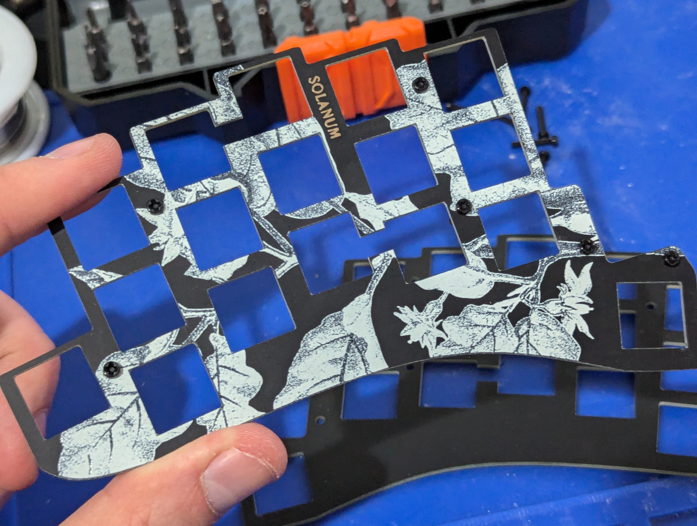
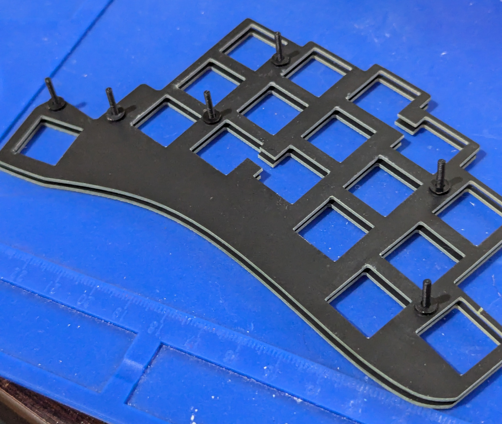
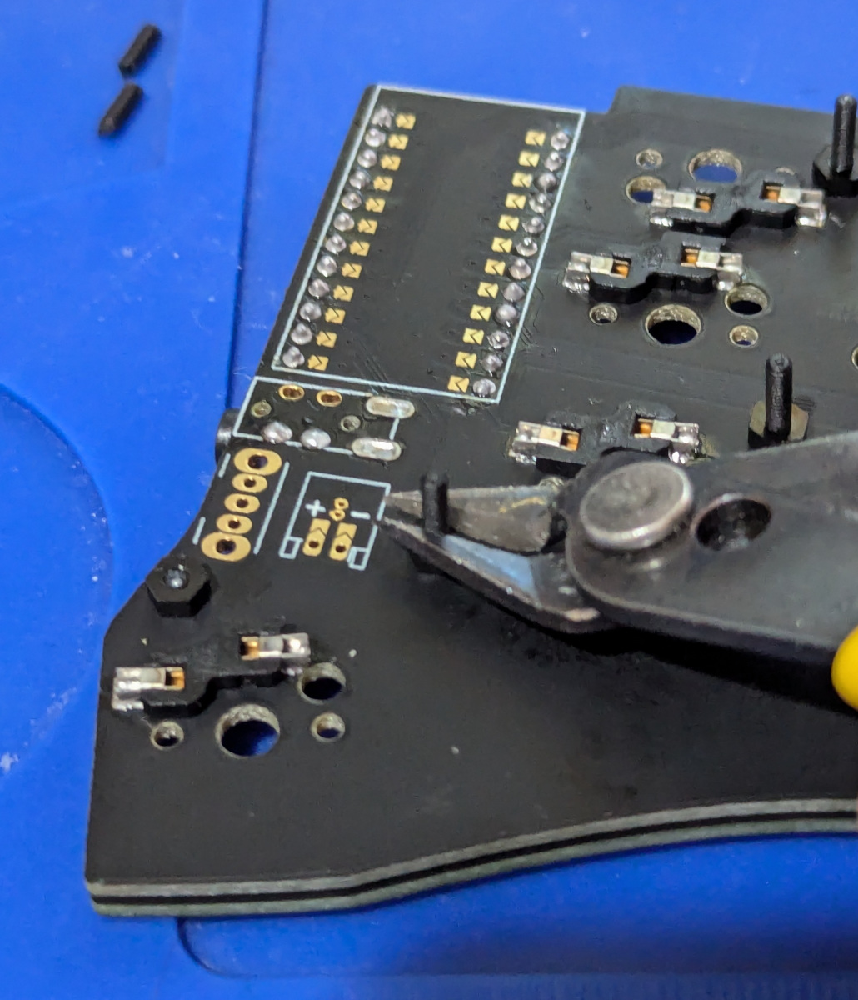
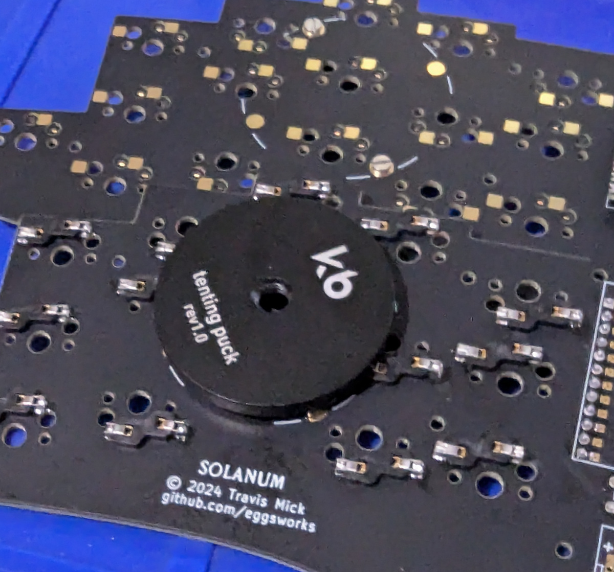

# Solanum Build Guide

## Materials

- 2x PCB
- 2x switchplate
- 2x Pro Micro compatible MCU module
- 34x Kailh Choc hotswap sockets
- 34x Kailh Choc switches
- 34x 1u Choc keycaps
- 12x nylon M2 screws
- 12x nylon 1mm M2 washers
- 12x nylon M2 nuts

For wired build:
- 2x PJ-320A TRRS jack
- 1x TRRS cable

For wireless build:
- 2x JST S2B-PH-K-S
- 2x C&K OS102011MA1QN1

Optional:
- 2x splitkb tenting pucks
- 2x 3D printed MCU cover
- 4x 6mm M2 standoffs

## Build instructions

### 1. Solder hotswap sockets

### 2. Solder MCU jumpers on the BACK of each half

### 3. Solder microcontrollers on the front (preferably in sockets)

### 4. Solder components specific to wired or wireless build

For wired, just solder the TRRS jacks to the front on each half.

For wireless, first solder the power switches on the front. Next, solder the JST jack jumpers on the side where the polarity matches that of your battery. Then, solder the JST jack itself on the front.

Now is a good time to verify that there are no shorts using a multimeter in continuity mode. Most importantly, make sure that the two battery terminals are not shorted if you are doing a wireless build.

### 5. Mount switchplate

First, put screws through the holes on the front of each half.

If using the MCU covers, replace those two screws with standoffs.

Support it with something flat, flip it over, and add the washers.

Put the PCB on the plate face down, secure the nuts, then snip off the excess length of the screws.

### 6. Final assembly

Install the switches. To avoid damage, hold the hotswap sockets firmly from the back while pressing the switches in until they clip into the plate.

If you are using a tenting puck, install it next. Only two screws are required on each.

If using the MCU covers, install them now and secure them with the two extra nylon screws. You may need to cut them shorter beforehand if they are longer than the standoffs themselves.

Finally, install your keycaps, flash firmware, and enjoy.

## Firmware

ZMK: https://github.com/eggsworks/zmk-config/

QMK: https://github.com/eggsworks/qmk_firmware/tree/solanum/keyboards/eggsworks/solanum