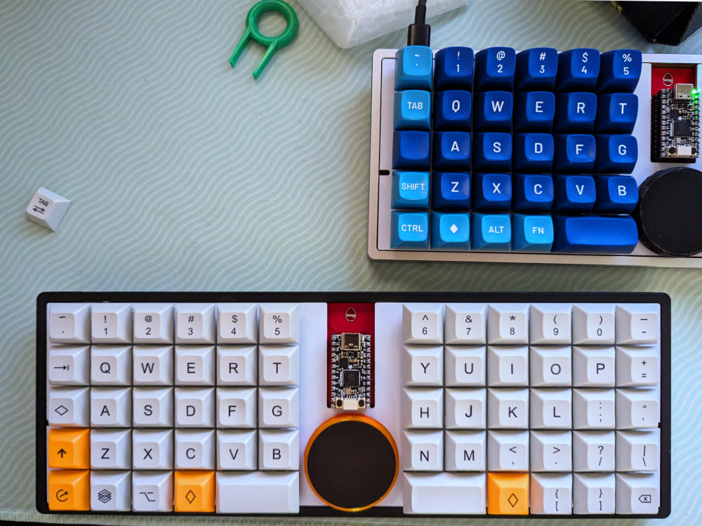
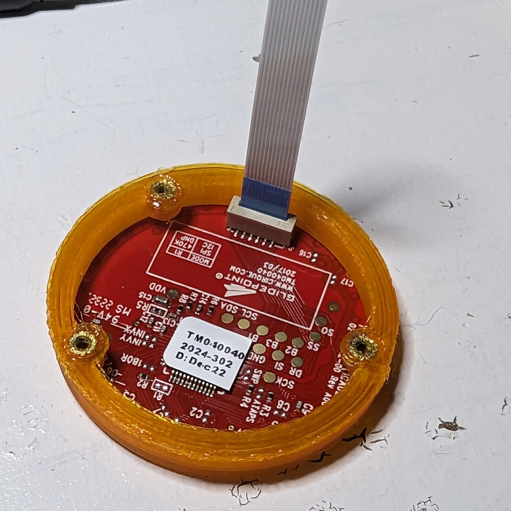
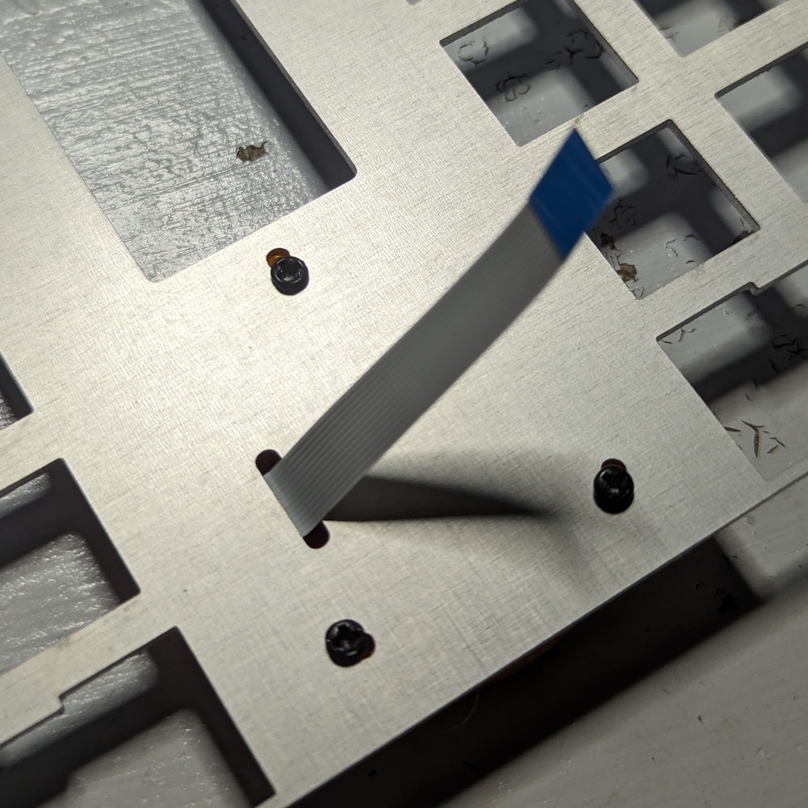
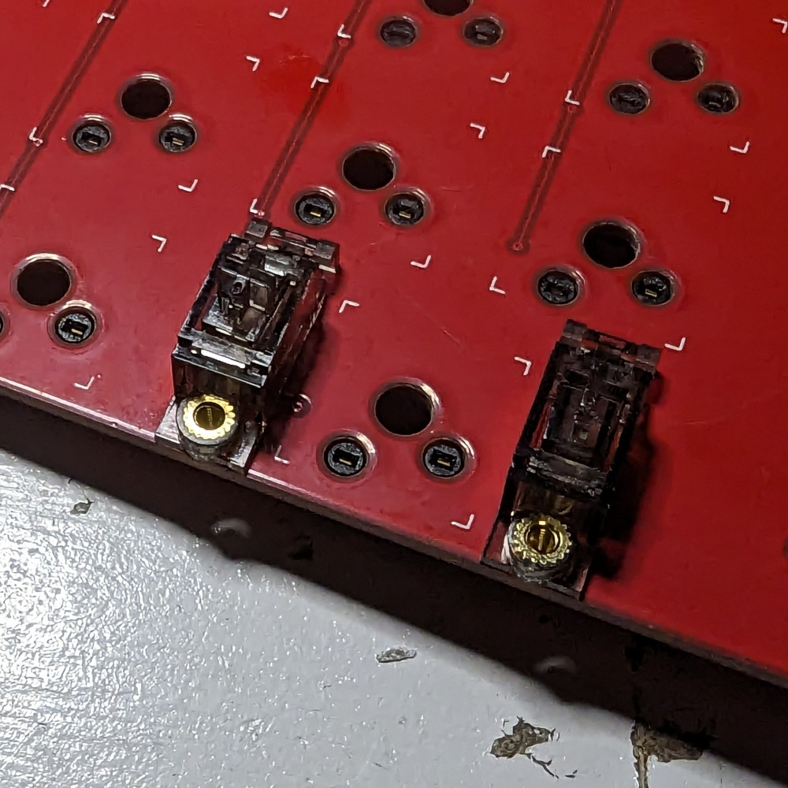
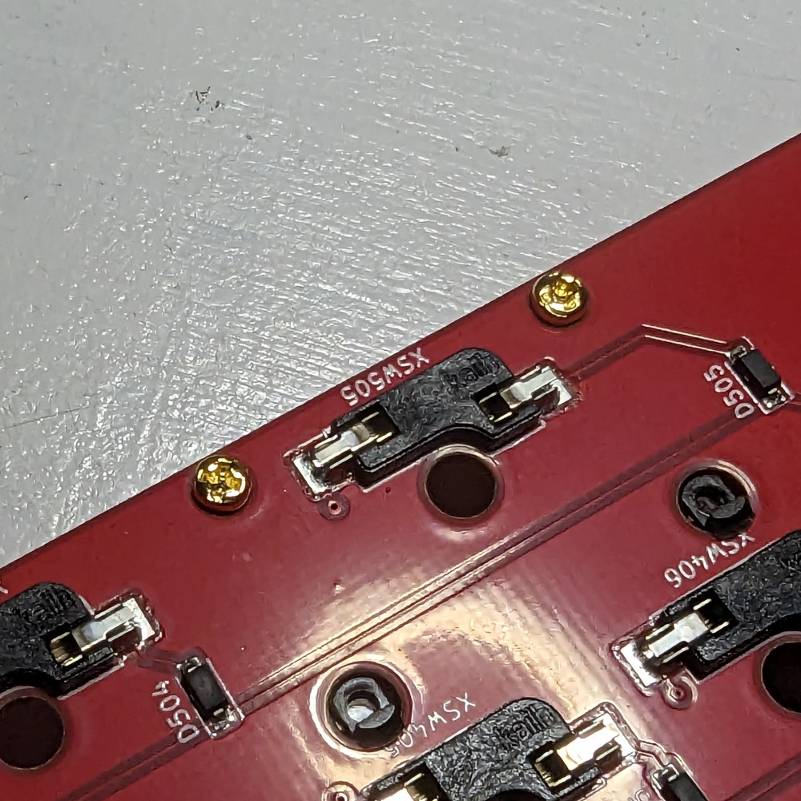
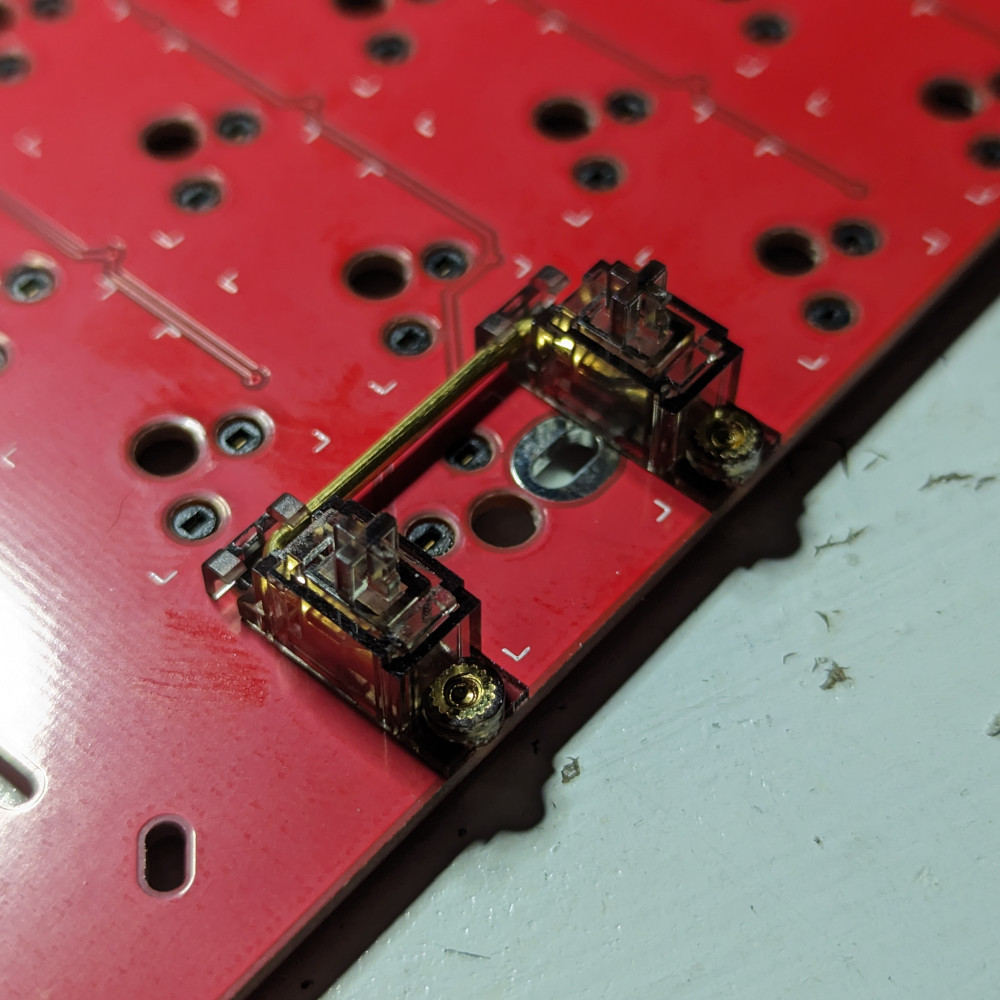
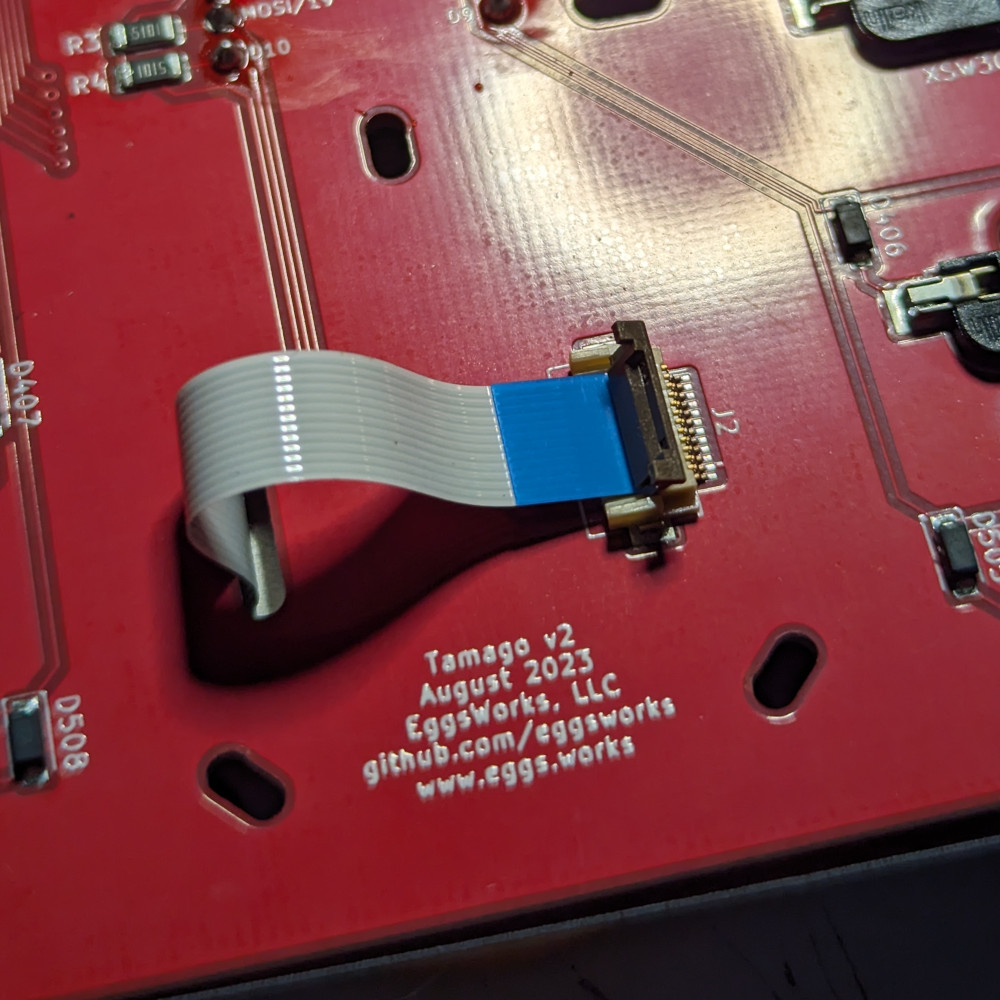
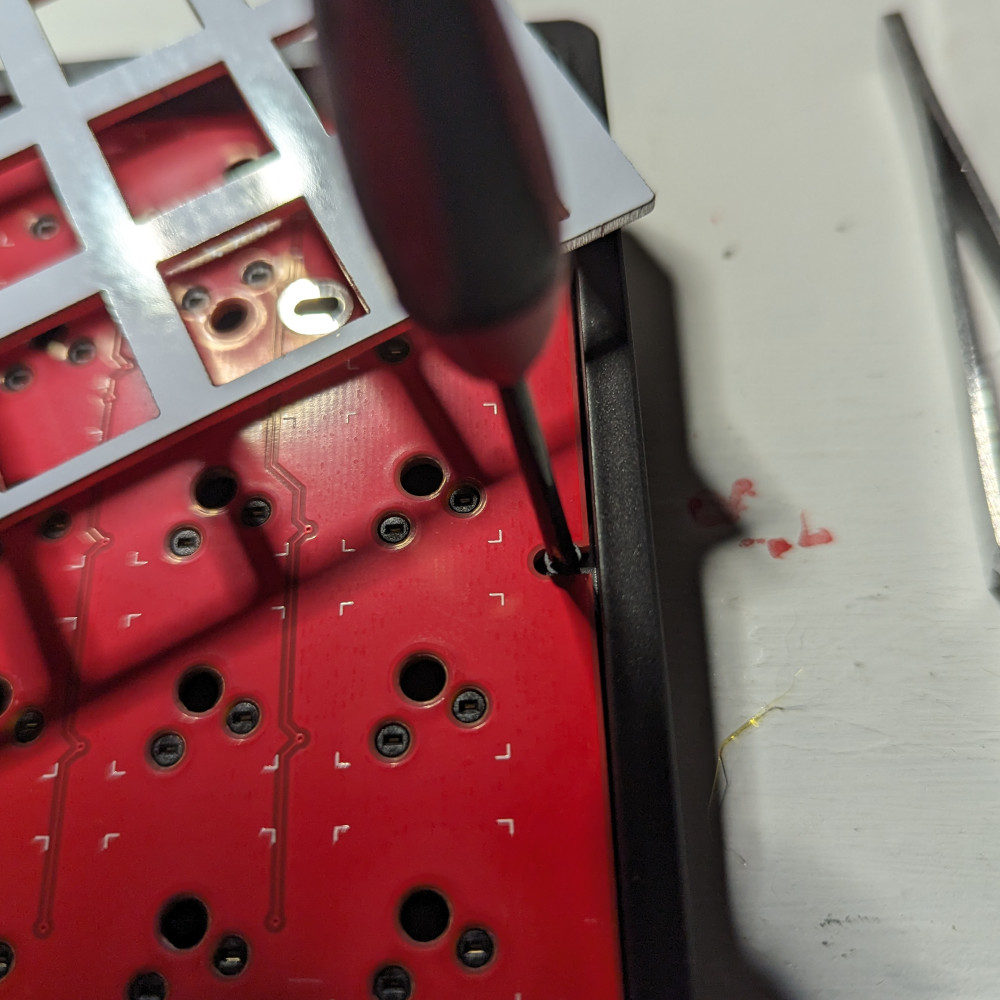
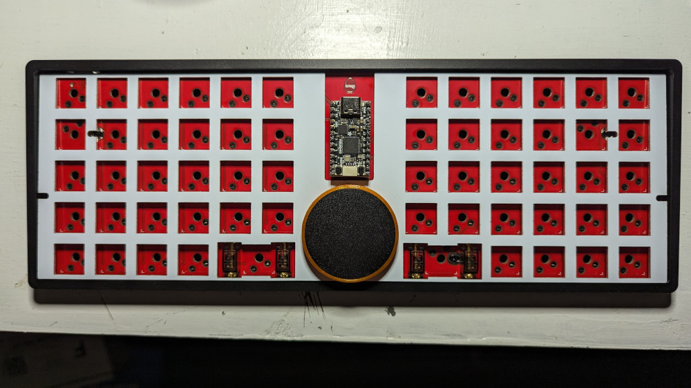

# Tamago II Build Guide

## Overview

Thanks for your interest in the Tamago II! We'll have it built in no time.

Your new Tamago II kit should come with the following contents:

- PCB
- Switchplate
- Stabilizers: four housings, four inserts, four screws, and two bars
- Trackpad
- Trackpad hardware: mounting ring, mounting screws, flat flex cable
- Case, plus its rubber feet and mounting screws

Please let us know if anything is missing or looks funny, and we'd be glad to help!

The only tool you'll need is a small phillips screwdriver.

## Step 1: Install the trackpad

Look for the notches on the bottom side of the trackpad, and orient it so they align with the corresponding features on the
mounting ring. Press down lightly, and it should snap into place. 

If it feels like it might pop out, feel free to add a small dab of glue to the lip of the ring. However, this normally
should not be necessary.

Next, insert the FFC in the socket on the trackpad. The side with the contacts should face the outside.

Feed the other end of the FFC through the slot on the switchplate. Make sure it is the right way around: the bare metal
side is the bottom; the top has solder mask applied. Align the three threaded holes on the mounting ring with the
holes on the switchplate, and use the three screws to secure it.

## Step 2: Install stabilizers

Slide the inserts into the housings. One corner of each should have a notch so you can make sure it is the
right away around.

Insert the clip sides into the larger holes of the PCB, and press down so the threaded parts go into
the smaller holes. Make sure the housing sits flush against the PCB.

Flip the PCB over and screw them in.

On the front again, insert the bars into each stabilizer slider and press down until they clip into the housings.

## Step 3: Start putting it together

Line up the switchplate with the PCB, and feed the FFC cable through the PCB slot.

Open the socket on the underside, insert the cable, and close it securely.

Lay the PCB and switchplate in the case, and start screwing the PCB into the tray.

You can move the switchplate slightly to access all the screw positions. Be careful not to be too forceful to avoid damage to the cable.

There are 6 screws in total.

## Step 4: Almost done!

You're ready to start installing switches!

The plate may flex a bit, preventing switches in the edge from clipping in. Use something to support
the plate from underneath from an adjacent cutout if necessary.

Once you're done installing the switches, just add keycaps, and then you're ready to go! Plug it in and enjoy.
