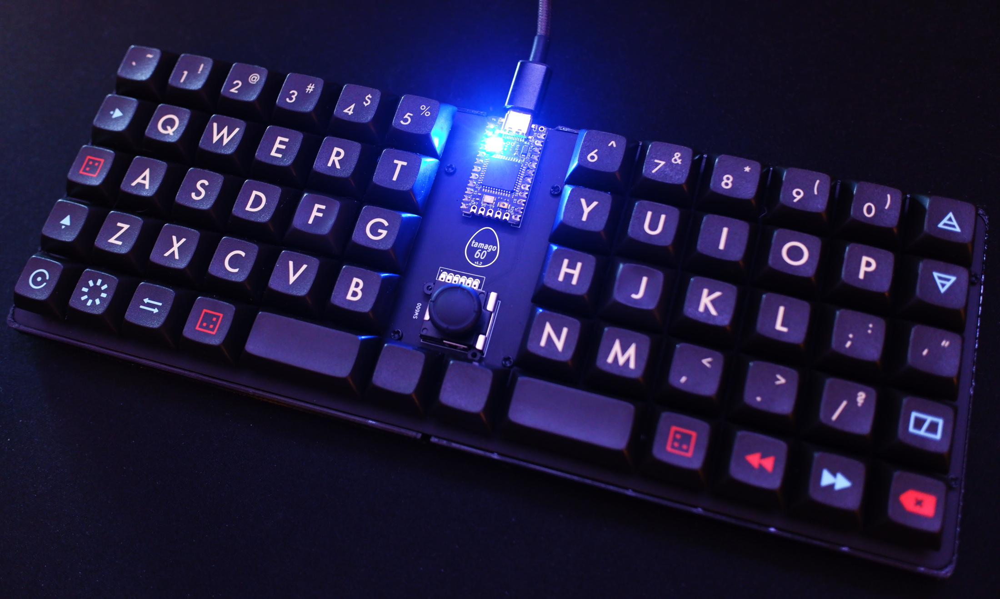
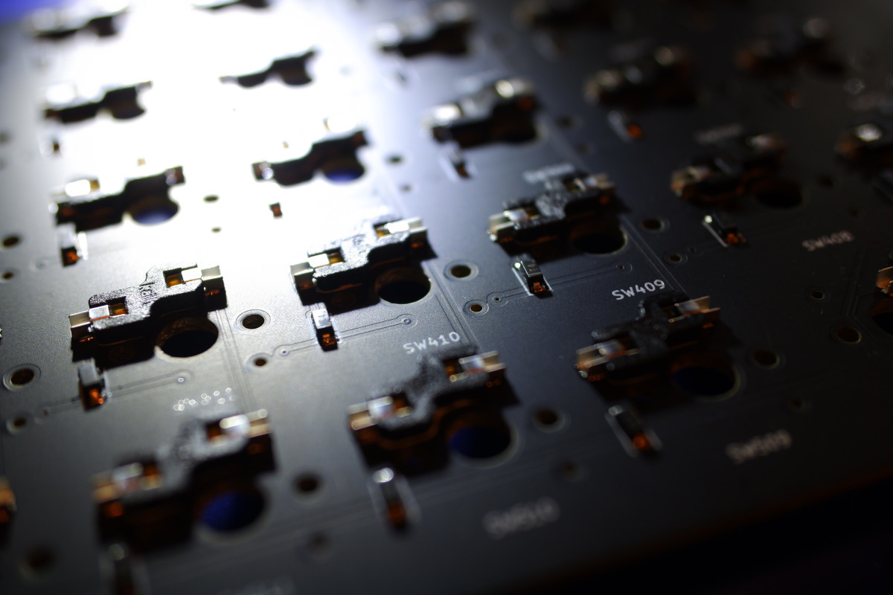

# tamago60 Build Guide

Your tamago60 kit should come with the following:

- 1 tamago60 PCB
- 64 Kailh Choc hotswap sockets
- 64 SMD diodes
- 1 joystick module
- A set of adhesive feet

In addition to a soldering iron, you will need these parts:

- 1 Pro Micro (or compatible) MCU module
- 60-62 Kailh Choc (original or Choc V2) switches
- A set of keycaps (58x 1u, 2x 2u)
- A USB cable (depends on your choice of MCU)

The number of switches you need depends on the configuration necessary for your 2u keycaps. If Using Choc v1, you just use the center socket
in each 2u position. If using Choc v2, then it differs between keycap sets. Some MX-stemmed 2u keycaps have two off-center stems and thus need two switches. If this is the case, only one is electrically connected and the other acts as a stabilizer. If your keycaps have the mounting position in the middle, you can just use the center position.

## Build instructions

This requires a good bit of experience with soldering, as there are lots of SMT components.

More detailed instructions with pictures are coming soon.

### 1. Install components on the back of the board

First, install all the SMT components.

- 61 diodes (cathode facing south)
- 64 sockets

Then, select two pads to bridge on the jumper near the joystick to choose whether the press action should be a left or right click (it shares a position in the matrix with one of the keyswitches below it).

Find the positions marked R1 and R2, and solder bridges across them - these resistors do not need to be populated.

### 2. Install components on the front of the board

- Install the MCU, preferably in a socket
- Install the joystick

### 3. Final assembly

That's all there is to it! Install your switches and keycaps, flash the firmware, and your board is ready to use.

More information on firmware is available [here](/docs/firmware).
