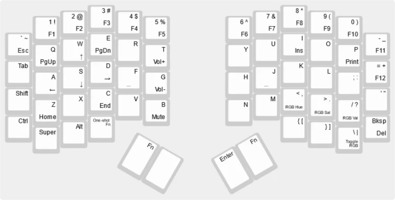
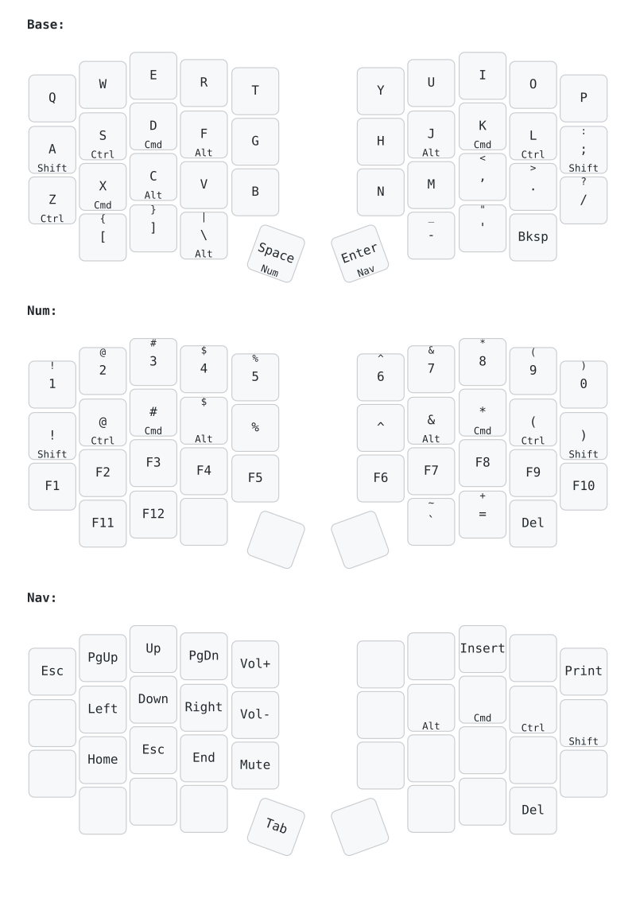
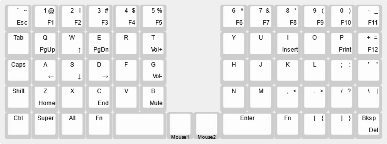

# Important!

This page is out of date! Most recent EggsWorks keyboards use ZMK! See [our ZMK Config repo](https://github.com/eggsworks/zmk-config) to download firmware for all boards not listed here.

## Firmware

We use QMK and VIA firmware for our boards. For more information or installation instructions, visit the [QMK website](https://docs.qmk.fm/) or [VIA website](https://www.caniusevia.com/).
 
## Egg58

The egg58 is now supported in the official QMK and VIA repositories. As of June 1, 2023, the prebuilt egg58 has shipped with VIA support by default.

- Source: https://github.com/eggsworks/qmk_firmware/tree/egg58
- Binary: https://github.com/eggsworks/qmk_firmware/releases/tag/egg58-2023-05-31

If you're interested in tinkering with ZMK instead, a working configuration repo is available to reference [here](https://github.com/eggsworks/zmk-config/tree/master/config/boards/shields/egg58bt) (but is not officially supported at this time).

Default layout:

## Chicklet

Firmware for the Chicklet is available in our fork of QMK.

- Source: https://github.com/eggsworks/qmk_firmware/tree/chicklet-devel
- Binary: Coming soon

Default layout:

## Tamago60

Firmware for the Tamago boards is maintained in a separate fork of QMK.

- Source: https://github.com/eggsworks/qmk_firmware/tree/tamago60
- Binary: https://github.com/eggsworks/qmk_firmware/releases/tag/tamago60-2023-04-21

Default layout:

## Tamago II

Firmware for the Tamago boards is maintained in a separate fork of QMK.

- Source: https://github.com/eggsworks/qmk_firmware/tree/tamago_v2
- Binary: Coming soon

